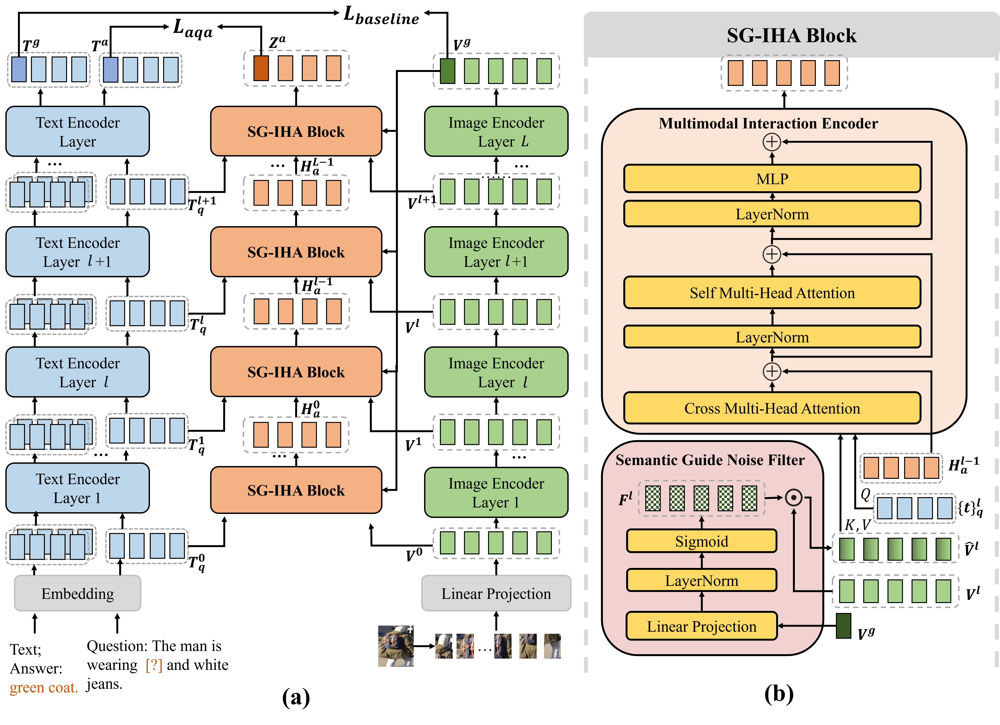

# SG-IHA: Semantic-Guided Implicit Hierarchical Alignment for Text-Based Person Re-Identification
## Highlights

we propose a novel Semantic-Guided Implicit Hierarchical Alignment (SG-IHA) module for TBPReID, which is a generic implicit local alignment module and can be deployed only during training without additional inference cost. SG-IHA performs multi-level semantic alignment across multiple encoder layers and is trained via an attribute question answering (AQA) task that masks complete attribute phrases rather than random tokens to encourage meaningful phrase-level concept alignment. Moreover, to alleviate the noise inference in features from low layers, SG-IHA includes a semantic-guided noise filter to reweight informative cues.




## Usage
### Requirements
we use V100 with 32GB for training and evaluation. 
```
pytorch 1.9.0
torchvision 0.10.0
prettytable
easydict
```

### Prepare Datasets
Download the CUHK-PEDES dataset from [here](https://github.com/ShuangLI59/Person-Search-with-Natural-Language-Description), ICFG-PEDES dataset from [here](https://github.com/zifyloo/SSAN) and RSTPReid dataset form [here](https://github.com/NjtechCVLab/RSTPReid-Dataset)

Organize them in `your dataset root dir` folder as follows:
```
|-- your dataset root dir/
|   |-- <CUHK-PEDES>/
|       |-- imgs
|            |-- cam_a
|            |-- cam_b
|            |-- ...
|       |-- reid_raw.json
|
|   |-- <ICFG-PEDES>/
|       |-- imgs
|            |-- test
|            |-- train 
|       |-- ICFG_PEDES.json
|
|   |-- <RSTPReid>/
|       |-- imgs
|       |-- data_captions.json
```


## Training
1、CLIP-finetune + SG-IHA module
```
bash ./run_clip_finetune_SG-IHA.sh
```
2、IRRA + SG-IHA module
```
bash ./run_irra_SG-IHA.sh
```

## Testing

```python
python test.py --config_file 'path/to/model_dir/configs.yaml'
```

## Acknowledgments
Some components of this code implementation are adopted from [IRRA](https://github.com/anosorae/IRRA). We sincerely appreciate for their contributions.

